# AgentOS

A web UI control plane for [Hermes Agent](https://hermes-agent.nousresearch.com) — dashboard, session history, kanban board, cron editor, profile editor, and more. Runs as an s6 service inside the Hermes container, or standalone alongside any Hermes installation.

**Version:** 1.0.0

## Features

- **Agent Dashboard** — Live status cards for all your Hermes profiles (model, provider, gateway state, session count, idle/running status). Auto-discovers the default profile and all sub-profiles. Includes hardware monitoring widget (CPU/RAM/Disk)
- **Session History** — Browse, search, and filter all conversation sessions with FTS5 full-text search
- **Session Detail** — Read-only chat thread viewer with reasoning blocks, tool call expansion, chronological message order (oldest first), pagination with page navigation, follow-tail auto-scroll, and floating scroll-to-top/bottom buttons
- **Analytics Dashboard** — Token usage analytics (per-model breakdown, 7-day trend charts, cache hit rates), activity heatmap (day×hour grid in local timezone), and live system resource monitoring (CPU, RAM, disk, uptime, load average)
- **Kanban Board** — Interactive task board with drag-and-drop between 5 columns (backlog, ready, running, done, blocked), markdown rendering in cards, task detail view, and archived toggle
- **Task Editor** — Edit title, body, assignee, priority, and status in a modal dialog
- **Filters & Search** — Filter kanban tasks by assignee, priority, status; search by title
- **Bulk Operations** — Multi-select tasks for batch status changes
- **Config Viewer** — Collapsible tree + YAML toggle with secret redaction and search/filter
- **Config Editor** — Inline editors (text, number, boolean, list) with atomic write and secret field protection
- **Skills Hub** — Grid view of installed skills with category colors, search, filter, sort, and detail modal
- **Workflow Editor** — React Flow canvas with custom nodes (trigger/action/condition), full CRUD
- **Workflow Execution** — Toposort engine with cycle detection, Run Now, run history, and node config
- **Authentication** — JWT-based auth with login page, protected routes, and multi-user support. Password hashing via `hashlib.pbkdf2_hmac` (bcrypt-free, stdlib only)
- **User Management** — Admin settings page to list, create, and delete users, and change passwords
- **Cron Job Editor** — CRUD operations on cron jobs with run now, pause/resume, and inline schedule/prompt editing
- **Advanced Profile Editor** — 6-tab editor: Model, Agent, Toolsets, Description, Memory (SOUL.md), and Preview (live YAML)
- **Dark/Light Mode** — Toggle in navbar with localStorage persistence
- **Keyboard Shortcuts** — ⌘K quick search, `g+{d,s,t,c,k,w}` navigation, `?` help modal
- **Responsive Design** — Hamburger menu on mobile, adaptive layout
- **Markdown Everywhere** — react-markdown + remark-gfm + rehype-highlight in chat, cards, comments, and tasks
- **Visual Identity** — Dark mission-control aesthetic with teal/gold accents, Inter + JetBrains Mono typography
- **Cross-Platform** — Works in Docker containers, Linux/macOS pip installs, and Windows

## Screenshots

### Login

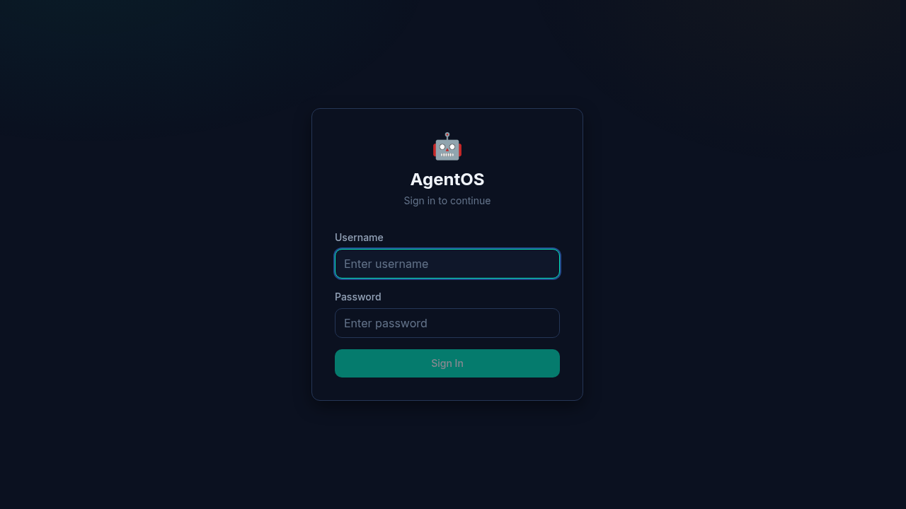

### Dashboard — Agent Health Cards

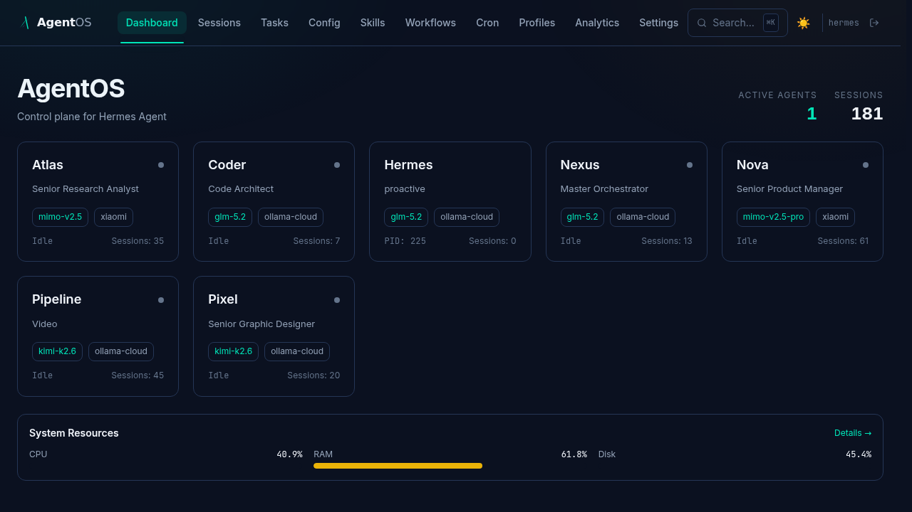

### Session History

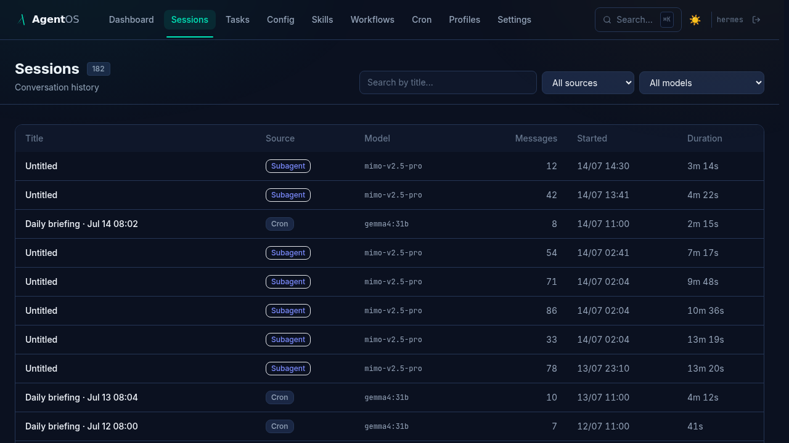

### Kanban Board

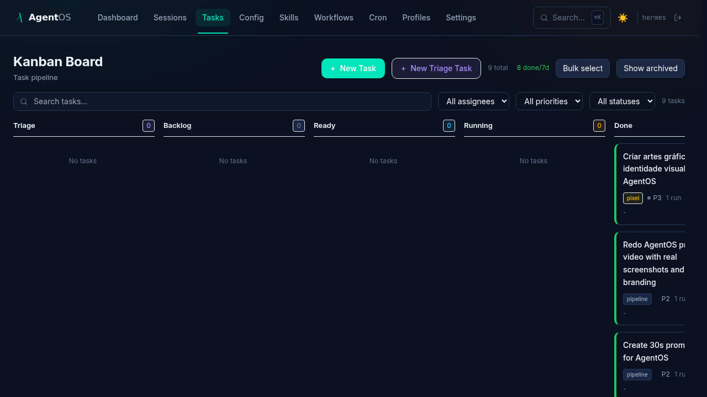

### Config Viewer (with secret redaction)

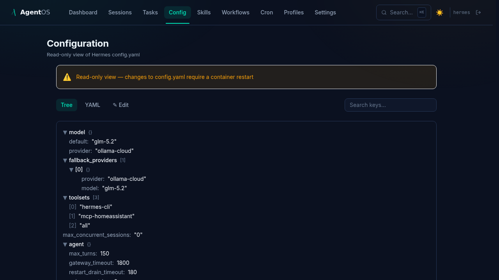

### Skills Hub

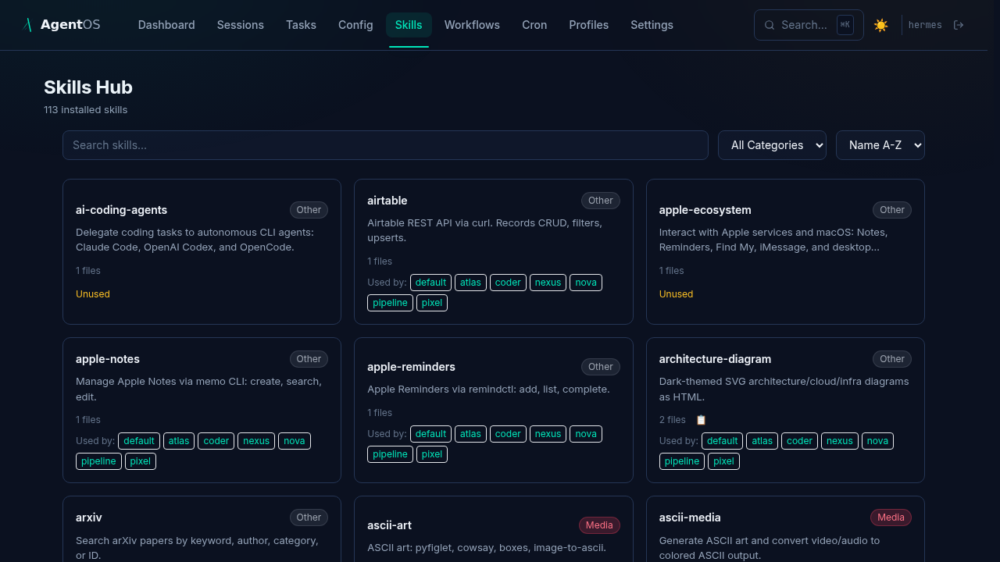

### Workflow Editor

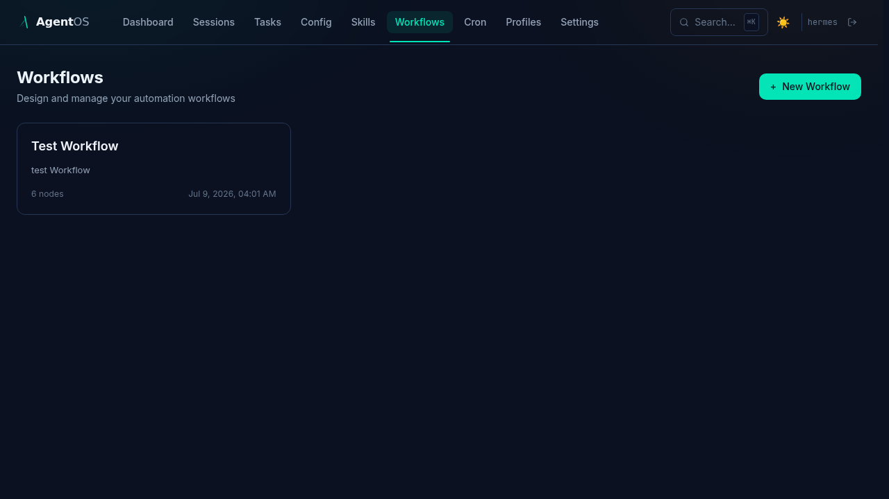

### Cron Job Editor

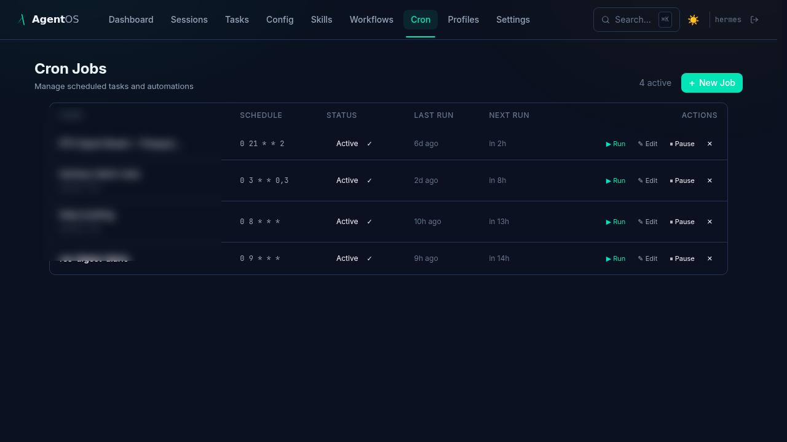

### Profile Editor — Grid

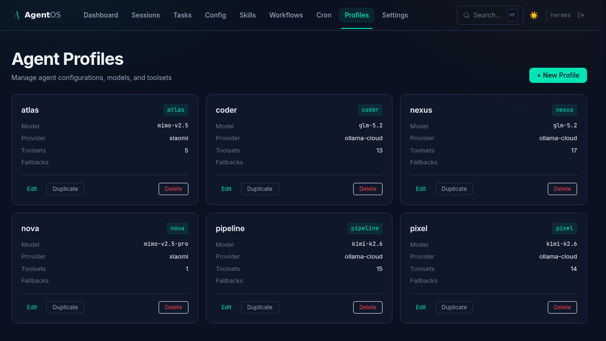

### User Management

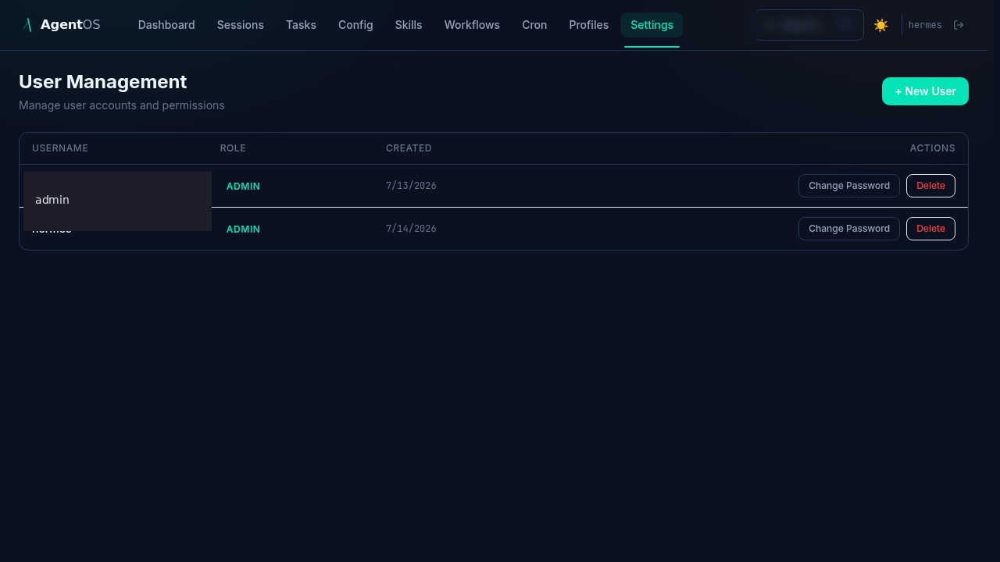

### Profile Editor — Model Tab

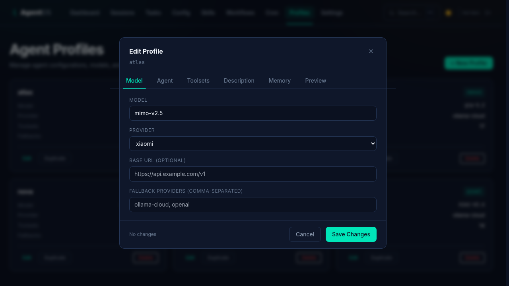

### Profile Editor — Toolsets Tab

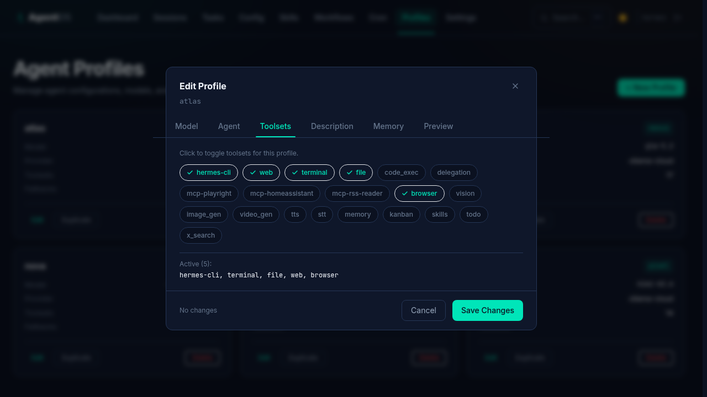

### Profile Editor — YAML Preview Tab

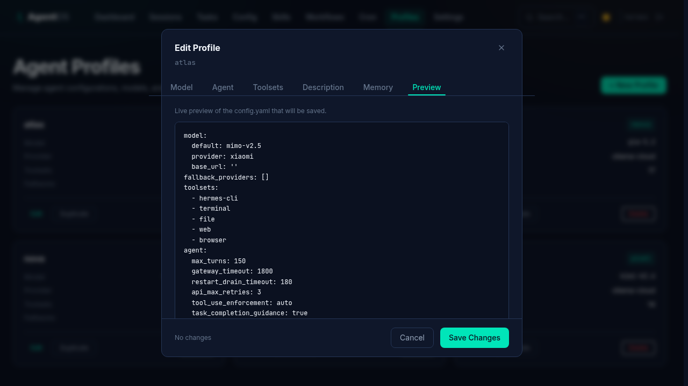

### Analytics — Token Usage, Activity Heatmap & System Resources

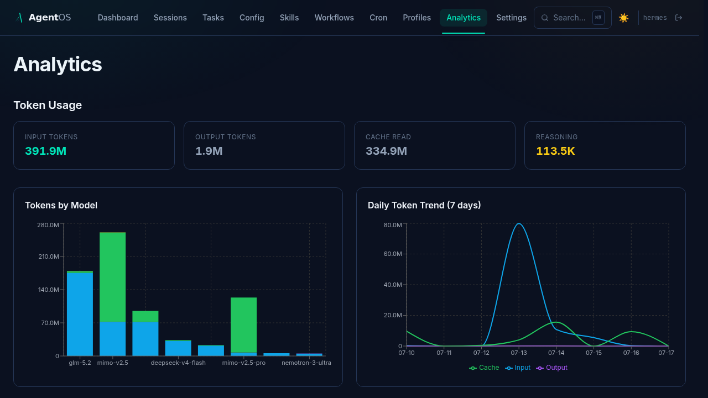

### Session Detail — Pagination with Follow Tail

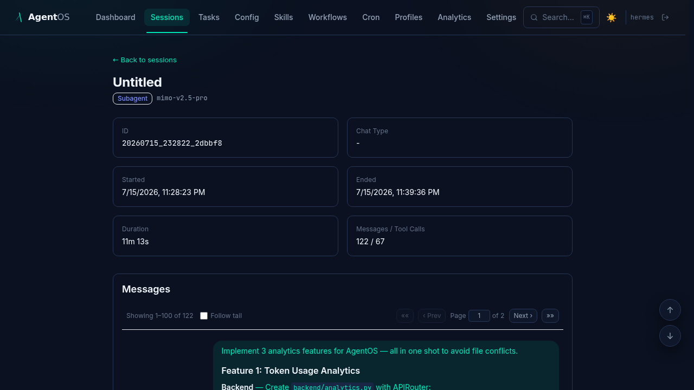

## Quick Start (Dev Mode)

```bash
cd agentos

# Backend
pip install fastapi uvicorn[standard] aiosqlite pydantic-settings cachetools httpx pyjwt
python3 -m uvicorn backend.main:app --host 0.0.0.0 --port 9120

# Frontend (another terminal)
cd frontend
npm install
npm run dev
```

Backend runs on http://localhost:9120, frontend dev server on http://localhost:5173.

### First-Run Authentication

On first launch, AgentOS auto-creates an admin user from environment variables:

```bash
export AGENTOS_ADMIN_USER=admin
export AGENTOS_ADMIN_PASS=your-secure-password
```

If not set, defaults to `admin` / `admin` (change immediately). After login, visit `/settings` to manage users.

For production, build the frontend and serve via FastAPI:

```bash
cd frontend && npm run build
# Built assets go to frontend/dist/ — FastAPI serves them at /
```


## Installation for AI Agents

> **This section is designed for AI agents (Hermes, Claude, GPT, etc.) to install AgentOS automatically.** Follow these steps based on your environment.

### Prerequisites Check

Before starting, verify:
```bash
# Check Python version (3.10+ required)
python3 --version

# Check Node.js (18+ required)
node --version

# Check if Hermes is running
ps aux | grep hermes

# Check if s6 is available (Docker container)
ls /run/s6/services/ 2>/dev/null || echo "Not in s6 container"
```

### Option 1: s6 Docker Container (Recommended)

If you're running inside a Hermes Docker container with s6-overlay:

```bash
# 1. Clone or download AgentOS
cd /opt/data
git clone https://github.com/Bendak/hermes-agentos.git agentos 2>/dev/null || cd agentos && git pull

# 2. Install Python dependencies
cd /opt/data/agentos
pip install fastapi uvicorn[standard] aiosqlite pydantic-settings cachetools httpx

# 3. Build frontend
cd /opt/data/agentos/frontend
npm install
npm run build

# 4. Create s6 service directory
mkdir -p /opt/data/s6-agentos

# 5. Create s6 run script
cat > /opt/data/s6-agentos/run << 'EOF'
#!/command/execlineb -P
cd /opt/data/agentos
s6-setuidgid hermes
python3 -m uvicorn backend.main:app --host 0.0.0.0 --port 9120
EOF
chmod +x /opt/data/s6-agentos/run

# 6. Create finish script
cat > /opt/data/s6-agentos/finish << 'EOF'
#!/bin/sh
exit 0
EOF
chmod +x /opt/data/s6-agentos/finish

# 7. Link to s6 services (if s6 is available)
if [ -d "/run/s6/services" ]; then
    ln -sf /opt/data/s6-agentos /run/s6/services/agentos
    echo "AgentOS linked to s6 services"
fi

# 8. Start the service
cd /opt/data/agentos
nohup python3 -m uvicorn backend.main:app --host 0.0.0.0 --port 9120 > /tmp/agentos.log 2>&1 &
echo "AgentOS started on port 9120"

# 9. Verify it's running
sleep 2
curl -s http://localhost:9120/health || echo "Health check failed"
```

### Option 2: Linux Desktop / WSL

```bash
# 1. Install dependencies
sudo apt update
sudo apt install -y python3 python3-pip nodejs npm

# 2. Clone AgentOS
cd ~
git clone https://github.com/Bendak/hermes-agentos.git agentos
cd agentos

# 3. Install Python packages
pip3 install fastapi uvicorn[standard] aiosqlite pydantic-settings cachetools httpx

# 4. Build frontend
cd frontend
npm install
npm run build
cd ..

# 5. Create systemd service (optional)
sudo tee /etc/systemd/system/agentos.service << EOF
[Unit]
Description=AgentOS
After=network.target

[Service]
Type=simple
User=$USER
WorkingDirectory=$HOME/agentos
ExecStart=$(which python3) -m uvicorn backend.main:app --host 0.0.0.0 --port 9120
Restart=always

[Install]
WantedBy=multi-user.target
EOF

# 6. Enable and start
sudo systemctl daemon-reload
sudo systemctl enable agentos
sudo systemctl start agentos

# 7. Verify
curl -s http://localhost:9120/health
echo "AgentOS running at http://localhost:9120"
```

### Option 3: Windows PowerShell

```powershell
# 1. Check prerequisites
python --version
node --version

# 2. Clone AgentOS
cd $env:USERPROFILE
git clone https://github.com/Bendak/hermes-agentos.git agentos
cd agentos

# 3. Install Python packages
pip install fastapi uvicorn[standard] aiosqlite pydantic-settings cachetools httpx

# 4. Build frontend
cd frontend
npm install
npm run build
cd ..

# 5. Create startup script
@"
@echo off
cd /d "%USERPROFILE%\agentos"
python -m uvicorn backend.main:app --host 0.0.0.0 --port 9120
pause
"@ | Out-File -FilePath start-agentos.bat -Encoding ASCII

# 6. Start AgentOS
Start-Process -FilePath "start-agentos.bat" -WindowStyle Normal

# 7. Verify
Start-Sleep -Seconds 2
try {
    $response = Invoke-WebRequest -Uri "http://localhost:9120/health" -UseBasicParsing
    Write-Host "AgentOS running at http://localhost:9120"
} catch {
    Write-Host "Health check failed - check logs"
}
```

### Configuration

After installation, configure AgentOS:

```bash
# Edit config (if needed)
nano /opt/data/agentos/backend/config.py

# Key settings:
# - KANBAN_DB: Path to kanban database (default: /opt/data/kanban.db)
# - STATE_DB: Path to state database (default: /opt/data/state.db)
# - ALLOWED_ORIGINS: CORS origins (default: *)
```

### Verification

After installation, verify everything works:

```bash
# Health check
curl http://localhost:9120/health

# List tasks (should return JSON)
curl http://localhost:9120/api/tasks

# Open in browser
echo "Open http://localhost:9120 in your browser"
```

### Troubleshooting

**Port already in use:**
```bash
lsof -i :9120
kill -9 <PID>
```

**Database not found:**
```bash
# Create empty databases if missing
touch /opt/data/kanban.db /opt/data/state.db
```

**Frontend not loading:**
```bash
# Rebuild frontend
cd /opt/data/agentos/frontend
npm run build
```

**Permission denied:**
```bash
# Fix permissions
chmod -R 755 /opt/data/agentos
chown -R $(whoami):$(whoami) /opt/data/agentos
```

## Configuration

AgentOS auto-detects your Hermes data directory:

| Environment | Default Path | Detection |
|---|---|---|
| Docker container | `/opt/data` | Marker file `/opt/data/.hermes` |
| Linux / macOS | `~/.hermes` | Home directory fallback |
| Windows | `%USERPROFILE%\.hermes` | Home directory fallback |

Override with environment variables:

```bash
AGENTOS_DATA_DIR=/custom/path    # Explicit override
HERMES_DATA_DIR=/hermes/path     # Hermes native variable (also detected)
```

### Profile Discovery

AgentOS discovers profiles from two locations:

1. **Default profile** — `config.yaml`, `SOUL.md`, `gateway_state.json` at the data root (e.g. `/opt/data/`)
2. **Sub-profiles** — Each subdirectory under `profiles/` (e.g. `/opt/data/profiles/coder/`)

All profiles are shown on the dashboard with live gateway state, model info, and session counts.

## Architecture

```
┌─────────────────┐
│   Browser       │
│  localhost:9120 │
└────────┬────────┘
         │
┌────────▼────────┐
│   AgentOS       │
│  FastAPI +      │
│  React (Vite)   │
│  Port 9120      │
└────────┬────────┘
         │
┌────────▼────────┐
│   Hermes Agent  │
│  localhost:8642 │
│  state.db       │
│  kanban.db      │
│  profiles/      │
│  config.yaml    │
└─────────────────┘
```

AgentOS reads Hermes state directly from:
- `state.db` (SQLite) — session history, messages, FTS5 search
- `kanban.db` (SQLite) — task board, task runs, comments (read + write for status updates)
- `config.yaml` + `profiles/*/config.yaml` — agent model, provider info
- `gateway_state.json` — live gateway PID and state
- `SOUL.md` — agent role description

## API Endpoints

| Endpoint | Description |
|---|---|
| `GET /health` | Health check |
| `GET /api/agents` | List all profiles with live status |
| `GET /api/sessions` | Paginated session list with filters (search, profile, date) |
| `GET /api/sessions/{id}` | Session metadata |
| `GET /api/sessions/{id}/messages` | Chat messages with pagination |
| `GET /api/tasks` | Kanban board tasks |
| `GET /api/tasks/{id}` | Task detail with runs and comments |
| `PATCH /api/tasks/{id}` | Update task status (drag-and-drop) |
| `GET /api/config` | Config tree (secrets redacted) |
| `GET /api/config/raw` | Config as YAML text (secrets redacted) |
| `PATCH /api/config` | Update config fields (secret fields rejected) |
| `GET /api/skills` | List all installed skills (metadata only) |
| `GET /api/skills/{slug}` | Get skill detail (full SKILL.md + file list) |
| `GET /api/profiles` | List profiles with model, skill counts, external dirs |
| `POST /api/auth/login` | Login (returns JWT token) |
| `GET /api/auth/me` | Current user info |
| `POST /api/auth/logout` | Logout (invalidate token) |
| `GET /api/users` | List all users (admin) |
| `POST /api/users` | Create user (admin) |
| `DELETE /api/users/{id}` | Delete user (admin) |
| `PATCH /api/users/{id}/password` | Change user password (admin) |
| `GET /api/workflows` | List all workflows |
| `GET /api/workflows/{id}` | Get workflow detail (nodes + edges) |
| `POST /api/workflows` | Create new workflow |
| `PUT /api/workflows/{id}` | Update workflow (name, nodes, edges) |
| `DELETE /api/workflows/{id}` | Delete workflow |
| `POST /api/workflows/{id}/run` | Execute workflow (toposort engine) |
| `GET /api/workflows/{id}/runs` | Get workflow run history |
| `GET /api/runs/{id}` | Get run detail with node results |
| `GET /api/cron/jobs` | List all cron jobs |
| `POST /api/cron/jobs` | Create cron job |
| `PUT /api/cron/jobs/{id}` | Update cron job |
| `DELETE /api/cron/jobs/{id}` | Delete cron job |
| `POST /api/cron/jobs/{id}/run` | Run cron job now |
| `POST /api/cron/jobs/{id}/pause` | Pause cron job |
| `POST /api/cron/jobs/{id}/resume` | Resume cron job |
| `GET /api/profiles/{name}` | Get profile detail with config + soul |
| `PUT /api/profiles/{name}/soul` | Write SOUL.md content |

## Tech Stack

- **Backend** — FastAPI (Python 3.13+), SQLite, uvicorn, aiosqlite
- **Frontend** — React 18, Vite 5, Tailwind CSS, TanStack Query, React Router, @dnd-kit (drag-and-drop), React Flow (workflow canvas), react-markdown + remark-gfm + rehype-highlight
- **Auth** — JWT (stdlib hmac), bcrypt-free password hashing (`hashlib.pbkdf2_hmac`), no C dependencies
- **Fonts** — Inter (UI), JetBrains Mono (code/data)
- **Design** — Dark theme (`#0B1120` base), teal accent (`#00E5B9`), gold secondary (`#F5B800`)

## Roadmap

- [x] Phase 0 — Bootstrap (FastAPI + Vite scaffold)
- [x] Phase 1 — Agent Dashboard (live health cards, dynamic profile discovery)
- [x] Phase 2 — Session History (list, search, FTS5, pagination, filters)
- [x] Phase 3 — Session Detail (chat thread, reasoning blocks, tool calls)
- [x] Phase 3.5 — Markdown rendering (react-markdown, syntax highlighting, GFM)
- [x] Phase 4 — Kanban Board (read-only, 5 columns, task detail, archived toggle)
- [x] Phase 5 — Kanban Drag & Drop (@dnd-kit, PATCH endpoint, markdown in cards)
- [x] Phase 6 — Task Detail Panel (tabs: Overview, Runs, Comments, Children)
- [x] Phase 7 — Config Viewer (read-only tree + YAML view, secret redaction)
- [x] Phase 8 — Config Editor (inline editing, atomic write, secret field protection)
- [x] Visual Identity — DESIGN.md spec, dark mission-control theme, Pixel design refinement
- [x] s6 Autostart — cont-init.d script, survives container rebuilds
- [x] Phase 9 — Skills Hub (browse installed skills, search, filter, detail modal)
- [x] Phase 10 — Workflow Editor (React Flow canvas, CRUD, node palette, dark theme)
- [x] Phase 11 — Workflow Execution (toposort engine, Run Now, run history, node config)
- [x] Phase 12 — Polish (dark/light toggle, ⌘K search, nav shortcuts, responsive)
- [x] Phase 13 — Auth (JWT, login page, ProtectedRoute, AuthContext, multi-user)
- [x] Phase 14 — Kanban Integration (task editor, filters/search, comments, bulk ops, webhook)
- [x] Phase 15 — User Management (Settings page, create/delete users, change passwords)
- [x] Phase 16 — Cron Job Editor (CRUD, run now, pause/resume, edit schedule/prompt)
- [x] Phase 17 — Profile Editor (6 tabs: Model, Agent, Toolsets, Description, Memory, Preview)

See [PLAN.md](PLAN.md) for the full roadmap and [DESIGN.md](DESIGN.md) for the visual identity spec.

## License

MIT
